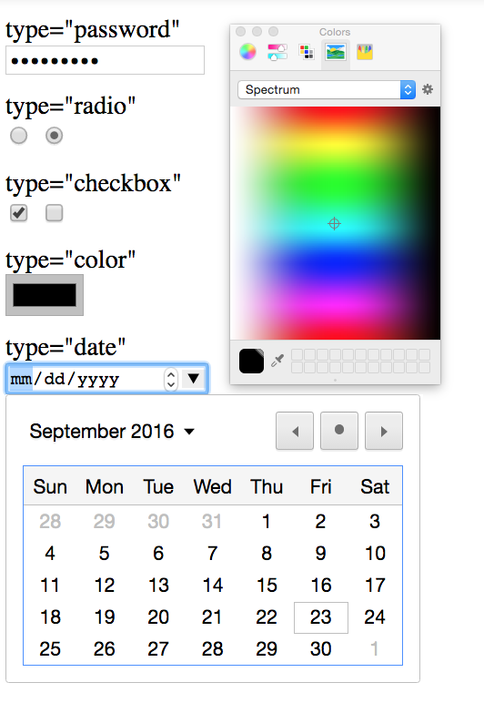
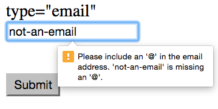

# Module 6: Writing Accessible HTML Documents

## Overview
Writing HTML documents allows you to provide structure and meaning to the information you're trying to communicate. As developers, we are responsible for ensuring that the documents that we create are easily interpreted by web-browsers, [screen readers](https://en.wikipedia.org/wiki/Screen_reader), and [alternative input devices](https://askjan.org/media/altinput.html) that interpret HTML structure. In this module, we'll cover the basic approaches for ensuring that the documents we create are properly rendered across devices.

<!-- START doctoc generated TOC please keep comment here to allow auto update -->
<!-- DON'T EDIT THIS SECTION, INSTEAD RE-RUN doctoc TO UPDATE -->
**Contents**

- [Resources](#resources)
- [Semantic HTML](#semantic-html)
- [Encoding Additional Information](#encoding-additional-information)
  - [HTML Attributes](#html-attributes)
  - [WAI-ARIA](#wai-aria)
    - [Aria Labels](#aria-labels)
    - [Aria role](#aria-role)
- [Using VoiceOver](#using-voiceover)
- [Forms](#forms)
  - [Inputs](#inputs)
    - [Labels](#labels)
    - [Input Type](#input-type)
  - [Buttons and Dropdowns](#buttons-and-dropdowns)
  - [Built-in Error Handling](#built-in-error-handling)

<!-- END doctoc generated TOC please keep comment here to allow auto update -->

## Resources
- [HTML5 Semantic Elements](http://www.w3schools.com/html/html5_semantic_elements.asp)
- [UW Web Accessibility Checklist](http://www.washington.edu/accessibility/checklist/)
- [Applicable Aria Roles](https://www.w3.org/TR/html-aria/#docconformance)
- [HTML Input Types](http://www.w3schools.com/html/html_form_input_types.asp)
- [HTML Select Element](http://www.w3schools.com/tags/tag_select.asp)
- [Mac VoiceOver](https://www.apple.com/voiceover/info/guide/)

## Conceptual Approach
In order to construct documents that are usable across devices, we need to **encode meaning** into the structure of our webpages. The primary approach is to use the proper HTML elements to describe the hierarchy of information on a webpage. As you likely know, it's easy to manipulate CSS styles to vary the visual representation of elements. However, these visual specifications _**do not**_ make documents easier to navigate on alternative devices. Instead, you'll need to use the appropriate `<tags>` that encode the desired hierarchy of your page.

The second approach is to provide additional information to alternative devices, such as screen readers. In the sections below, you'll learn how to use proper HTML structure in combination with specific element **attributes** to encode meaning your page. These are crucial when HTML elements fall short.

## Semantic HTML
**Semantic** elements are elements that have an inherent _meaning_. Before the release of HTML5, it was common to use elements that were not semantically meaningful (i.e., `<div>`) to represent page areas that were common across many pages, such as **navigation** menus, or page **footers**. HTML5 introduced a variety of different semantically meaningful elements to help describe the **role** of each section of a page. This is not only helpful for screen readers, but immensely useful for organizing your code. Below is a table of _some_ HTML5 semantically meaningful elements (see all [here](http://www.w3schools.com/html/html5_semantic_elements.asp)):

| Elements | Description     |
| :------------- | :------------- |
| `<header>`| Specifies the top of a document or section, typically used at the top of a webpage |
| `<nav>`| An element that contains navigational links |
| `<main>`| Demarcates the primary section of content on the page |
| `<section>`| A grouping of elements that constitute a similar theme |
| `<footer>`| The bottom section of a page or document |

These fit together to form a semantically meaningful webpage:

```html
<!doctype html>
<html>
    <head>
        <!-- Put meta tags and other pertinent information here -->
    </head>
    <body>
        <!-- Top of page in a header -->
        <header>
            <!-- Navigational content -->
            <nav>
                <!-- Links go in here -->
            </nav>
        </header>

        <!-- Main content for your page -->
        <main>
            <section>...content in here...</section>
            <section>...content in here...</section>
        </main>

        <!-- Bottom of your page -->
        <footer>
        </footer>
    </body>

</html>
```
While you can make a website _look_ how you want without these elements, your code will be difficult to read, and unaccessible by to populations dependent on screen readers.

It's worth noting that heading elements (`h1`, `h2`, `h3`, etc.) are also semantically meaningful. As such, you should use them as section labels, and _**not just to impose a desired style**_. Relatedly, because screen readers navigate through the hierarchy of heading elements, you _**should not skip headers**_ (i.e., you should have an `h2` element between an `h1` and an `h3`).

## Encoding Additional Information
While semantically meaningful elements help you organize your page, you often need to provide additional information about a particular element. There are two methods for providing additional information to HTML elements:

1. Some HTML elements, such as images, have default attributes for providing supplemental information to screen readers
2. When HTML elements are insufficient, there are specified attributes developed by the [Web Accessibility Initiative](https://en.wikipedia.org/wiki/WAI-ARIA) to make HTML documents additionally accessible.

### HTML Attributes
Image tags (``) have a default `alt` attribute which you should use to provide _alternate_ text to a screen reader. This text will also render on the page if a web-browser is unable to load the image:

```html
<!-- Provide meaningful alternate text for images -->

```
Note, it's unnecessary to include a prefix such as _"photo of..."_ in your alternate text.

### WAI-ARIA
_The Web Accessibility Initiative - Accessible Rich Internet Application_ is a technical specification which provides a syntax for enhancing the navigability and interpretability of "rich" HTML documents. These are used for more "rich" internet application that support user interaction, such as forms. This syntax can be used to label content, describe function, or describe the state of an application (i.e., if a checkbox is checked).

#### Aria Labels
Aria labels can be used to describe static content. For example, if you wanted to provide additional information about a visual element to a screen reader, you could use an `aria-label` attribute:

```html
<!-- aria-label provides descriptions for arbitrary elements -->
<div class="green-rect" aria-label="a giant green rectangle"></div>
```

If there is text section which describes a visual element, you can use the `aria-describedby` attribute.

```html
<div class="green-rect" aria-describedby="#rect-detail"></div>
<p id="rect-detail">The above rectangle is giant and green.</p>
```

In the code snippet above, we are using an `id` property to reference the labeling paragraph.

#### Aria role
In addition to various `aria-*` attributes, the `role` attribute is an WAI-ARIA syntax for describing the function that an element fulfills. For example, to avoid the default visual rendering of a `<button>` element, you may want to instead use a `<span>` tag. However, this is a **less informative** structure for your page, and a screen reader would have no way of identifying a span as a button. The `role` attribute allows you to specify the function of such elements. This [table](https://www.w3.org/TR/html-aria/#docconformance) describes the implicit **role** of each semantically meaningful element, and identifies the set of aria roles that can be applied to those elements.

```html
<span role="button">Click Me</span>
```

In addition to the use of `role` elements, there are semantically meaningful HTML elements to use for building forms.

## Using VoiceOver
VoiceOver is the screen reading technology built into Mac operating systems. It is a very powerful tool, but is fairly easy to get started. Here are a few pointers:

- Activate/deactivate VoiceOver by pressing `cmd-F5`
- Start reading a document by pressing `ctrl-option-a`
- Pause reading document by pressing `ctrl`
- Navigate between sections by pressing `ctrl-option-left/right` (arrow keys)
- Open up a header navigation menu by pressing `ctrl-option-u` (exit by pressing `esc`)

To practice using VoiceOver, and to demonstrate the importance of using proper HTML structure and ARIA roles, see [exercise-1](exercise-1).

## Forms
HTML5 provides a variety of elements for building forms. Understanding how to properly associate different elements in a form, and how to leverage built-in input `types` will make this common web-development task substantially easier. As you can imagine, the semantically meaningful element for an HTML form is the `<form>` tag. Within your form, you'll

### Inputs
Within your `<form>`, the `<input>` tag is the most common element for collecting information from your user. Depending on the `type` attribute assigned to your `<input>` element, the rendering and behaviors vary substantially.

#### Labels
In order to properly label each element, you'll need to use the `<label>` tag. Associating a label with an input element is _crucial_ for interpretability on screen readers, and is easily accomplished by setting the `for` attribute of a label:

```html
<!-- Create a form -->
<form>
    <!-- Create a label for the input -->
    <label for="first-name">First Name:</label>

    <!-- Create a text input -- note, it is a self-closing tag -->
    <input type="text" id="first-name">
</form>
```

Note, associating a label with an input also lends it additional functionality in a web-browser. If a label is associated with an input element, clicking the label will activate the input element, making the form easier to use. As you can see, we again used the `id` property of the `<input>` element to associate it with the label.

#### Input Type
The `type` attribute dictates the look and feel of your `input` element. Specifying a `type` can enable you to make a variety of enhancements to your form. It allows you to:

- Restrict the values you can type into the input box (`type="number"`)
- Change the rendering of the characters (`type="password"`)
- Change the visual layout of elements (`type="checkbox"`)
- Provide HTML5 selection menus(`type="date"`)

The image below shows how simply changing the input `type`, the rendering and behavior is substantially different:



In the image above, the color and date pickers are available **by default**!

### Buttons and Dropdowns
Buttons are often included in forms to provide common actions such as **clearing** a form, or **submitting** it. By simply changing the button `type` in an HTML form, you can assign these events to the buttons. Note, the default behavior for a form submission is to reload the page -- we'll learn how to disable this when we start writing JavaScript.

```html
<!-- Create a form -->
<form>
    <!-- Create a label for the input -->
    <label for="first-name">First Name:</label>

    <!-- Create a text input -- note, it is a self-closing tag -->
    <input type="text" id="first-name">

    <!-- Create buttons to clear and submit the form -->
    <button type="clear">Clear</button>
    <button type="submit">Submit</button>
</form>
```

The above buttons would **clear** all form information, or **submit** the form (respectively).

To create dropdown menus on forms, you'll encapsulate a variety of `<option>` elements inside of a `<select>` element.

```html
<form>
    <!-- Create a dropdown menu -->
    <select>
        <option value="option-1">Option 1</option>
        <option value="option-2">Option 2</option>
        <option value="option-3">Option 3</option>
    </select>
</form>
```
Note, each option can have an underlying value associated with the text which is displayed to the user.

### Built-in Error Handling
Placing the appropriate type on an `<input>` element both ensures proper rendering and helps provide informative error messages (by default!). Let's begin by making an input element **required**, by adding the **required** attribute to an `<input>` element. This is distinct from other attributes, in that we simply need to include it (rather than setting it equal to something):

```html
<!-- Create a form -->
<form>
    <!-- Create a label for the input -->
    <label for="first-name">Email Contact:</label>

    <!-- Create a text input -- note, it is a self-closing tag -->
    <input type="email" id="contact" required>
</form>
```

If you then try to submit the form with an invalid email address, HTML5 will provide an informative error message, such as this one:



To practice building HTML forms, see [exercise-2](exercise-2).
