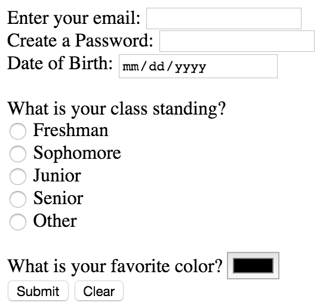

## Exercise 2: Forms

The purpose of this exercise is to build a simple HTML form, and to see the impact of assigning different `type` attributes to input and button elements. As described in [module-4](https://github.com/info343c-a16/m4-git-intro), start by forking and cloning this repository. When you open up the page on your local machine, follow the instructions in the `index.html` file to build a simple sign-up page.

Make sure to properly associate your labels with your input elements for screen reader performance! And don't worry, we'll build much more beautiful forms soon...

See the `complete` branch for answers.
